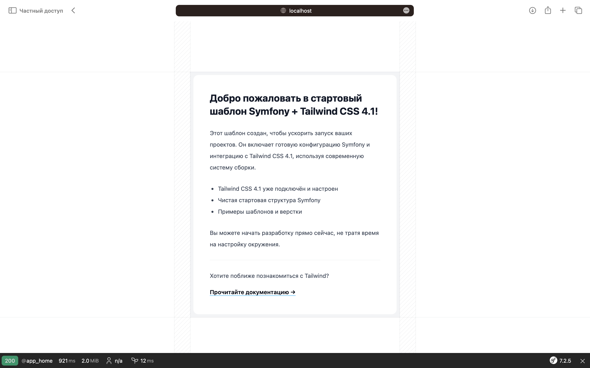
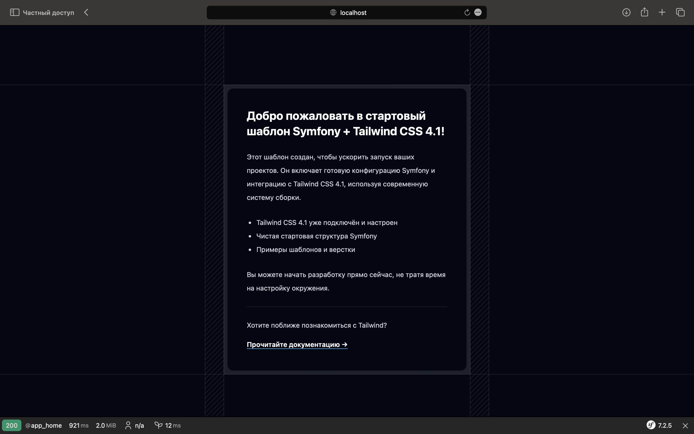

# Symfony + Tailwind CSS 4.1 Starter Kit 🚀

Шаблон для быстрого запуска нового проекта на **Symfony 7.2** с уже настроенным **Tailwind CSS 4.1**.  
Поддерживается **PHP 8.2**, светлая и тёмная тема, современная структура и готовая главная страница.

## 📌 Стек технологий

- ⚙️ **PHP 8.2**
- 🧱 **Symfony 7.2**
- 🎨 **Tailwind CSS 4.1**
- 🌗 Поддержка тёмной темы
- 🧪 Готовый контроллер и шаблон главной страницы

## 🚀 Быстрый старт

```bash
# Клонировать проект
git clone https://github.com/csitrovsky/symfony-tailwind-starter.git my-project

cd my-project

# Удалить историю коммитов (по желанию)
rm -rf .git

# Установить PHP-зависимости
composer install

# Установить JS-зависимости
npm install

# Запустить сборку Tailwind
npm run dev

# Запустить сервер Symfony
symfony serve
```

> ⚠️ Убедитесь, что у вас установлены:
> - PHP >=8.2
> - Composer
> - Node.js >=18
> - Symfony CLI

## 🖥 Превью главной страницы




## 📁 Структура проекта

```
├── assets/              # Фронтенд (Tailwind CSS, JS)
├── config/              # Symfony конфигурация
├── public/              # Публичная директория (доступна извне)
├── src/                 # PHP-код, контроллеры, сущности
│   └── Controller/
├── templates/           # Twig-шаблоны
│   └── home/index.html.twig
├── .env                 # Переменные окружения
├── composer.json        # PHP зависимости
├── package.json         # JS зависимости
├── tailwind.config.js   # Конфигурация Tailwind
└── README.md            # Этот файл
```

## 🔧 Основные команды

| Команда         | Описание                               |
|-----------------|----------------------------------------|
| `npm run dev`   | Запустить Tailwind в режиме разработки |
| `npm run build` | Собрать CSS для продакшена             |
| `symfony serve` | Запустить Symfony-сервер               |

## 🎯 Возможности

- 📦 Быстрый старт Symfony + Tailwind
- 🎉 Встроенный шаблон главной страницы
- 🌗 Светлая и тёмная тема
- ✅ Готов к использованию как шаблон (`Use this template`)

## 🤝 Как использовать как шаблон

1. Нажмите кнопку **[Use this template](https://github.com/yourusername/symfony-tailwind-starter/generate)** в GitHub
2. Введите название нового проекта
3. Клонируйте новый репозиторий и работайте

## 📚 Полезные ссылки

- 📘 [Документация Symfony](https://symfony.com/doc/current/index.html)
- 🎨 [Tailwind CSS Docs](https://tailwindcss.com/docs)
- 🧰 [Composer](https://getcomposer.org/)
- 🧪 [Symfony CLI](https://symfony.com/download)

## 🪪 Лицензия

Проект распространяется под лицензией [MIT](LICENSE)

---

Сделано с ❤️ для разработчиков, которым важен быстрый и современный старт.